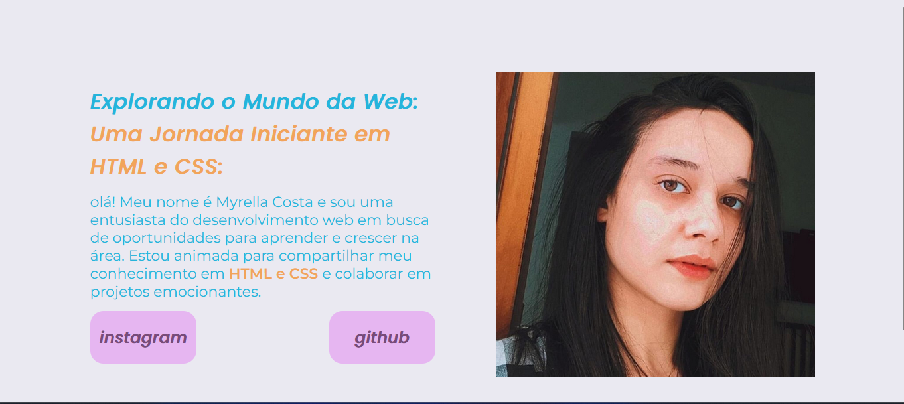

# Meu Primeiro Projeto no GitHub

Este é o meu primeiro projeto no GitHub, e estou animada para compartilhá-lo com a comunidade!

## Descrição

Este projeto foi criado como parte do meu aprendizado em programação e para me familiarizar com o GitHub e seus recursos. É um projeto simples, mas estou orgulhosa do meu progresso e das habilidades que estou adquirindo.

## Como Usar

Como este é um projeto simples, não há muita coisa aqui além deste arquivo `README.md`. Você pode navegar pelo repositório para ver os arquivos e códigos que adicionei durante o processo de aprendizado.

## Contribuição

Embora este seja apenas um projeto de aprendizado pessoal, sinto-me grata por qualquer feedback ou sugestão que você possa ter. Se você é um desenvolvedor experiente e vê algo que pode ser melhorado ou otimizado, não hesite em me informar. Estou sempre aberto a aprender e melhorar minhas habilidades.
---
*Este projeto é apenas um começo para mim no GitHub, mas estou ansiosa para continuar aprimorando minhas habilidades e compartilhando mais projetos no futuro!*

